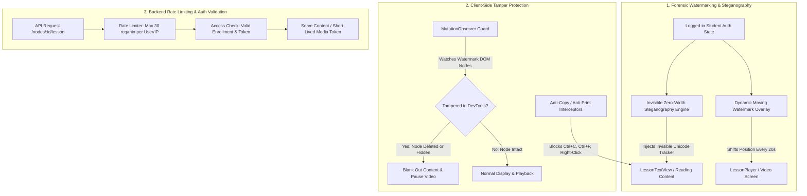

# Course Content Anti-Scraping & Forensic Protection Plan

A comprehensive, tamper-resistant defense-in-depth architecture designed to prevent automated scraping (BeautifulSoup, Puppeteer, cURL), block casual copying, and forensically fingerprint any leaked lecture notes or video recordings back to the offending user.

---

## 1. Architecture Overview

```
┌─────────────────────────────────────────────────────────────┐
│ 1. Edge & WAF (Cloudflare Bot Management, Turnstile, TLS)   │
├─────────────────────────────────────────────────────────────┤
│ 2. Backend Access Control & Rate Limiting (Token Masking)   │
├─────────────────────────────────────────────────────────────┤
│ 3. Video Protection (HLS Chunking + AES-128 Encryption)     │
├─────────────────────────────────────────────────────────────┤
│ 4. Dynamic Forensic Watermarking & Zero-Width Steganography │
├─────────────────────────────────────────────────────────────┤
│ 5. Client-Side Anti-Copy & MutationObserver DevTools Guard  │
└─────────────────────────────────────────────────────────────┘
```



---

## 2. Threat Models & Protection Mechanisms

| Threat / Tool | Mechanism | Protection Result |
| :--- | :--- | :--- |
| **BeautifulSoup / Scrapy** | Static HTTP crawler without JS engine | **100% Blocked**. Content is rendered dynamically in Next.js SPA; syllabus tree masks text/video URLs. |
| **Python `requests` / cURL with Auth Token** | Script calling backend API in a loop | **Blocked by Rate Limiting**. Max 30 requests/min per IP/User halts automated bulk downloads with HTTP 429. |
| **Browser Screen Recording / Screenshots** | Capturing video or reading text visually | **Dynamic Moving Watermark**. Student's email & ID shifts position every 20s, making recorded leaks immediately traceable. |
| **DevTools Watermark Removal** | Inspecting DOM to delete watermark `<div>` | **MutationObserver Guard**. Tampering triggers an instant content blanking and video pause. |
| **Copy-Pasting Plaintext Notes** | Extracting reading notes into Word / Telegram | **Invisible Zero-Width Steganography**. Invisible unicode characters (`\u200B`, `\u200C`, `\uFEFF`) encode user ID in plaintext, allowing forensic decoding of leaks. |
| **Direct Video File Download** | Right-click save video | **HLS Streaming & UI Guards**. Uses segmented `.m3u8` playlists with short-lived tokens, `controlsList="nodownload"`, and context menu suppression. |

---

## 3. Implementation Breakdown

### Component 1: Invisible Steganography & Watermark System (Frontend)

#### `fe/src/lib/steganography.ts`
- Utility to encode an identifier (e.g. user UUID or email) into invisible zero-width unicode characters (`\u200B`, `\u200C`, `\u200D`, `\uFEFF`).
- `embedFingerprint(text: string, userId: string): string`: Disperses invisible tracker bits throughout natural word boundaries in text.
- `decodeFingerprint(text: string): string | null`: Extracts user ID from leaked notes.

#### `fe/src/components/WatermarkOverlay.tsx`
- **Video Mode**: Renders a floating, semi-transparent (14% opacity) watermark with user email and timestamp that shifts to random coordinates every 18–25 seconds.
- **Reading Mode**: Renders a subtle, non-intrusive background watermark overlay across reading sheets.
- **Tamper Protection**: Includes a `MutationObserver` that monitors the watermark element. If the node is removed, detached, or hidden (`display: none`, `opacity: 0`), it invokes a tamper callback.

---

### Component 2: Course Player & Reading View Hardening (Frontend)

#### `fe/src/app/(user)/courses/s/[slug]/learn/_components/LessonTextView.tsx`
- Embed invisible steganography into `lessonDetails.text_content` before rendering.
- Add `<WatermarkOverlay variant="reading" onTamper={handleTamper} />`.
- If tampering is detected, hide text content and render security notice.
- Apply `userSelect: 'none'` and `-webkit-user-select: 'none'` on the reading container.
- Intercept and prevent right-click context menu, `Ctrl+C` / `Cmd+C` copy, and `Ctrl+P` / `Cmd+P` print shortcuts.

#### `fe/src/app/(user)/courses/s/[slug]/learn/_components/LessonPlayer.tsx`
- Add `<WatermarkOverlay variant="video" onTamper={handleTamper} />`.
- If tampering is detected, pause video and blank out the player.
- Set `controlsList="nodownload"` and `disablePictureInPicture` on the `<video>` element.
- Disable right-click context menu on video player.

#### `fe/src/app/(user)/courses/s/[slug]/learn/_components/QuizActiveAttempt.tsx`
- Apply anti-selection (`user-select: none;`) and right-click suppression on active quiz questions and options.

---

### Component 3: Backend API Rate Limiting (Backend)

#### `be/internal/api/server.go`
- Add strict rate limiting middleware on `/nodes/:id/lesson` and `/media/token/:videoId`:
  - Limit to **30 requests per minute per IP / authenticated user** to prevent scripts or bots from scraping entire course libraries in seconds.

---

## 4. Verification & Testing Strategy

1. **Steganography Fidelity**: Roundtrip unit tests verifying `embedFingerprint` and `decodeFingerprint` with English, Bengali, and HTML/MathJax text.
2. **Watermark & MutationObserver**: Unit tests verifying watermark rendering and tamper detection callback when DOM elements are modified.
3. **Anti-Copy Events**: Unit tests ensuring selection and copy/print event handlers are prevented.
4. **Backend Rate Limiting**: Integration tests verifying HTTP 429 response when exceeding 30 requests/minute.
