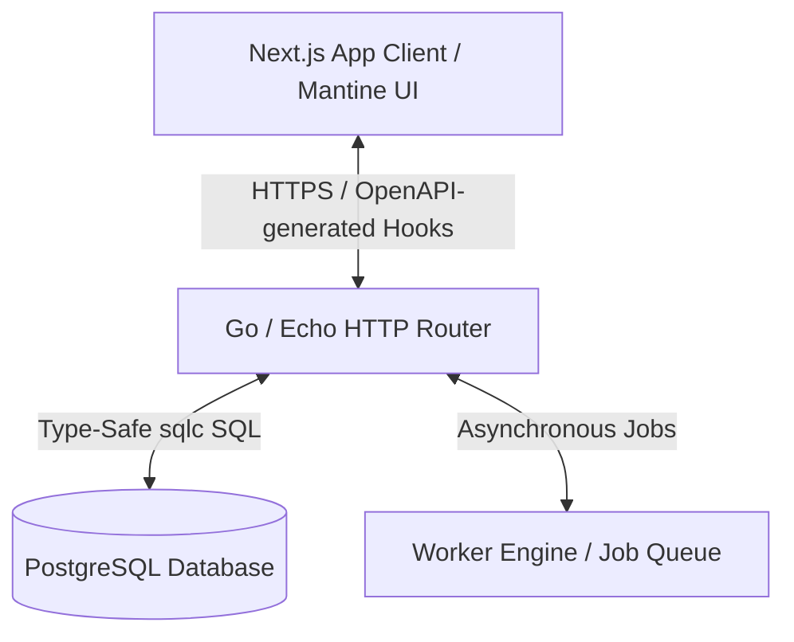

# Project Architectural Assessment

This document provides a comprehensive evaluation of the **Course Platform** codebase, assessing its design, scalability, complexity, developer velocity, and potential future bottlenecks.

---

## 1. Architectural Overview & Tech Stack

The project is structured as a modern decoupled client-server architecture:



### Backend (`be/`)
- **Core Framework**: Go with [Echo v4](https://echo.labstack.com/). Highly performant, minimal footprint, and structured routing.
- **Database Layer**: PostgreSQL accessed via raw SQL queries compiled using [sqlc](https://sqlc.dev/).
- **Business Logic**: Clean separation between `handlers/` (HTTP controller layer), `services/` (auth/token operations), `worker/` (asynchronous tasks), and `middleware/` (telemetry, security).
- **Monitoring**: Out-of-the-box integration with Prometheus metrics.

### Frontend (`fe/`)
- **Core Framework**: Next.js (utilizing the App Router paradigm).
- **Styling & UI**: Mantine UI, allowing for rapid interface building, clean layouts, and rich modern styling tokens.
- **Data Fetching & State Sync**: TanStack Query (React Query) driving all API requests and mutation states.
- **API Integration**: OpenAPI Spec-First design, with [Orval](https://orval.dev/) generating TypeScript models, request types, and Axios query hooks directly from the spec.

---

## 2. Assessment of Scalability

Overall Scalability Rating: **High**

### Key Scalability Strengths
1. **Lightweight DB Queries via sqlc**:
   Unlike heavyweight ORMs (e.g., GORM, Hibernate) which rely on reflection, slow runtime mapping, and complex automatic joins, **sqlc** generates static, type-safe Go code matching raw SQL. This minimizes CPU/memory overhead and yields near-native driver performance.
2. **Video Streaming Architecture (HLS)**:
   Streaming videos using **HLS (HTTP Live Streaming)** via `.m3u8` playlists and TS segments means the server doesn't stream massive GB-scale static video files. Instead, `hls.js` fetches tiny 10-second chunks on demand. This drastically reduces concurrent network bandwidth, enables adaptive bitrate switching, and allows content to be easily offloaded to a CDN (e.g., Cloudflare, CloudFront) in the future.
3. **Decoupled Job Workers**:
   The `be/internal/worker/` module separates intensive tasks (like payment syncing, mailers, and video token minting) from the HTTP request-response cycle. This keeps API latency low and enables independent scaling of worker processes.
4. **State Caching with TanStack Query**:
   By caching responses inside React state, the frontend prevents redundant network traffic (e.g., navigating back and forth in the lesson sidebar does not repeatedly query `/courses/s/{slug}/tree` unless explicitly invalidated).

---

## 3. Assessment of Complexity & Code Quality

Overall Complexity Rating: **Medium-High (Well-Managed)**

### Strengths in Code Maintenance & Velocity
1. **OpenAPI Spec-First Paradigm**:
   Defining endpoints in YAML (`be/docs/`) and generating client hooks using **Orval** creates a single source of truth. If API specifications change, typescript types and request definitions update automatically. This completely eliminates runtime type drift between backend and frontend.
2. **Clean Separation of Concerns**:
   The Go backend strictly follows the handler-repository-service pattern. Mocks are generated automatically (`mocks_test.go`), allowing unit tests to stub out database layers cleanly.
3. **Mantine UI & Componentization**:
   Rather than building UI components from scratch, using Mantine allows the frontend to focus on custom flow logic (such as dynamic quiz rendering and immersive slide transitions) while inheriting secure, responsive, and customizable elements.

---

## 4. Potential Bottlenecks & Areas of Improvement

While the codebase is clean and robust, the following areas should be optimized as user traffic scales:

### A. Caching Layer (Redis)
- **Current State**: The backend queries PostgreSQL directly for frequent operations (e.g., checking user access to a node on every video chunk request, listing curriculum trees).
- **Recommendation**: Integrate Redis to cache:
  - Enrolled courses lists (`/courses/enrolled`)
  - Course tree structures (invalidated only when an instructor edits the curriculum)
  - User permissions/access tokens

### B. Indexing and CTE Optimizations
- **Current State**: Hydrated course trees are loaded using a recursive Common Table Expression (CTE):
  ```sql
  WITH RECURSIVE tree AS (...)
  ```
- **Recommendation**: While fast for smaller hierarchies, recursive queries can slow down under high concurrency. Ensure fields like `nodes(parent_id)` and `courses(node_id)` have explicit foreign key indices. If the curriculum grows extremely large, consider caching the fully-built tree in JSON form within Postgres or Redis.

### C. Asynchronous Worker Queue Scalability
- **Current State**: Go goroutines or simple database-backed polling might be used for background queues.
- **Recommendation**: For enterprise scale, use a robust Redis-backed queue library like [Asynq](https://github.com/hibiken/asynq) or a message broker (RabbitMQ/NATS) to handle retries, dead-letter queues, and rate-limiting.

### D. Asset Offloading
- **Current State**: TS video segments are served by the application layer `/media-api/stream/...`.
- **Recommendation**: Secure these paths using signed URLs (e.g., Cloudflare Token Authentication) and offload the actual segment file distribution to an edge CDN. The Go server should only serve the index playlist (`.m3u8`) and perform JWT validations.

---

## 5. Conclusion

The architecture of this project is **exceptionally clean and well-structured**. By adopting an OpenAPI spec-driven workflow, typesafe Go sqlc, and React-Query cache management, the application achieves high developer velocity and strong scalability foundations. It avoids the performance traps of large monolithic frameworks and ORMs, positioning it well for production deployment.
