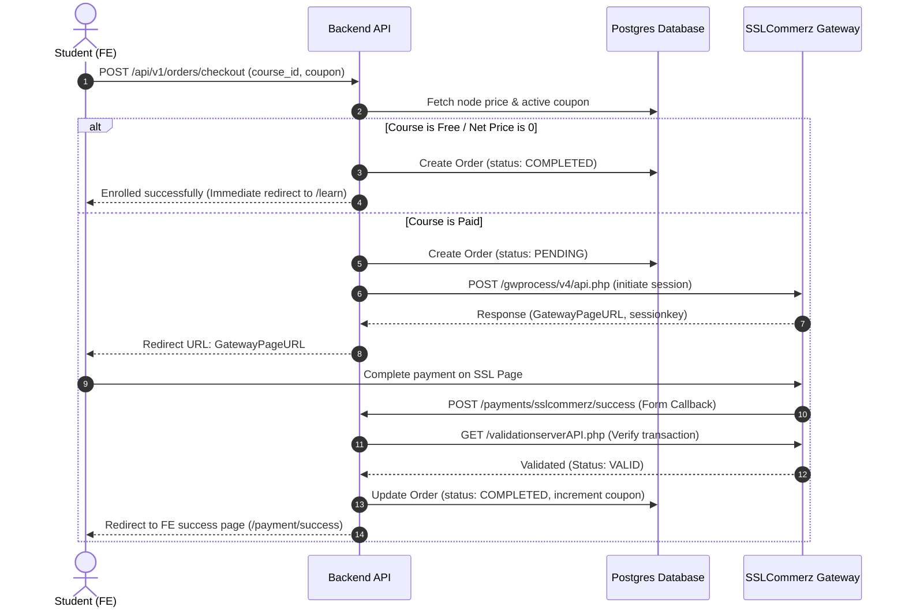

# Implementation Plan: SSLCommerz Payment Integration & Course Access Control

This plan details the implementation of the checkout, payment, and enrollment system using SSLCommerz (in sandbox mode for testing), along with fine-grained access control on the course curriculum for the Course Platform.

---

## 1. System Architecture

We will implement an enterprise-grade checkout process that separates the API logic, payment gateway clients, and database queries. The system handles both **paid** and **free** courses gracefully.



---

## 2. Backend Implementation (Go / Echo / SQLC)

### 2.1 Database Schema & Queries

We will add two core elements:
1. **Access Control Query**: To check if a user has purchased a node or any of its parent ancestors in the structural hierarchy.
2. **Retrieve Course with Pricing**: Update `content.sql` retrieval queries to join the `payment_gates` table so the client knows how much a course costs.

We will add the following SQL query to `be/internal/db/queries/commerce.sql`:
```sql
-- name: CheckUserAccessToNode :one
WITH RECURSIVE ancestors AS (
    -- Anchor: start from the specific node
    SELECT id, parent_id, node_type
    FROM nodes
    WHERE id = $1
    UNION ALL
    -- Recursive step: traverse up to the parent
    SELECT n.id, n.parent_id, n.node_type
    FROM nodes n
    JOIN ancestors a ON n.id = a.parent_id
)
SELECT EXISTS (
    SELECT 1 FROM orders o
    WHERE o.user_id = $2
      AND o.status = 'COMPLETED'
      AND o.node_id IN (SELECT id FROM ancestors)
) as has_access;
```

We will also update `GetCourse`, `GetCourseBySlug`, and `ListCourses` in `be/internal/db/queries/content.sql` to include a `LEFT JOIN payment_gates pg ON n.id = pg.node_id` to fetch the price and currency.

---

### 2.2 SSLCommerz API Client

We will build a dedicated, modular client wrapper in `be/internal/payment/sslcommerz/client.go` to handle raw HTTP requests to SSLCommerz endpoints.

#### Sandbox Testing
SSLCommerz provides a Sandbox environment for testing transactions without real money:
- **Sandbox Initiation URL**: `https://sandbox.sslcommerz.com/gwprocess/v4/api.php`
- **Sandbox Validation URL**: `https://sandbox.sslcommerz.com/validator/api/validationserverAPI.php`
- **Default Sandbox Store ID**: `testbox` (fallback if custom is not provided)
- **Default Sandbox Password**: `project393` (fallback if custom is not provided)
- **Test Cards**: We can use SSLCommerz standard sandbox card numbers (e.g. Visa starting with `411111...` or Mastercard with `511111...`) to test the checkout screens.

---

### 2.3 Order & Checkout Endpoints

We will create a new handler in `be/internal/handlers/commerce.go` that exposes the following REST APIs:

1. **`POST /api/v1/orders/checkout`**
   - **Access**: Protected (Requires JWT)
   - **Payload**: `{ "node_id": "string", "coupon_code": "string" }`
   - **Behavior**:
     - Check if already purchased. If so, return error.
     - Look up the node's price. If free, register the purchase immediately.
     - Apply any coupon.
     - Call SSLCommerz API to get a payment session.
     - Return the payment page URL.

2. **`POST /api/v1/payments/sslcommerz/success`**
   - **Access**: Public (SSLCommerz Form URL-Encoded Post)
   - **Behavior**: Validates with SSLCommerz Validator API. If valid, updates order status to `COMPLETED` and redirects to `${FRONTEND_URL}/payment/success?tran_id=...`.

3. **`POST /api/v1/payments/sslcommerz/fail`**
   - **Access**: Public
   - **Behavior**: Sets order status to `PENDING` or `FAILED` and redirects to `${FRONTEND_URL}/payment/fail?tran_id=...`.

4. **`POST /api/v1/payments/sslcommerz/cancel`**
   - **Access**: Public
   - **Behavior**: Redirects to `${FRONTEND_URL}/payment/cancel?tran_id=...`.

5. **`GET /api/v1/courses/s/:slug/access`**
   - **Access**: Protected
   - **Behavior**: Returns `{ "has_access": true/false }` indicating if the student has access to this course (either because it is free, purchased, or they are an admin).

---

### 2.4 Curriculum Access Restrictions

We must protect curriculum files:
1. **Curriculum Tree Masking**:
   - In `GetCourseTree` and `GetCourseTreeBySlug`, we will extract the current user (if logged in).
   - If the course is paid and the user has not purchased it (nor are they an admin), we will **strip/blank** the `video_url` and `text_content` fields from the tree array before sending the JSON response.
2. **Access Control on Content**:
   - We will add a protected user-facing endpoint `GET /api/v1/lessons/:id` which returns the full lesson details *only if* the user has access.

---

## 3. Frontend Implementation (Next.js / Mantine)

### 3.1 Course Landing Page Checkout Trigger

 we will modify `fe/src/app/(public)/courses/s/[slug]/page.tsx` to:
- Render the course price.
- Fetch user purchase status using `/api/v1/courses/s/:slug/access` (if logged in).
- If access is granted: Change "Enroll in Course" button to **"Go to Course Player"** (which links to `/courses/s/[slug]/learn`).
- If access is not granted: Add a **"Promo Code" input field** and wire up "Enroll in Course" to call `/api/v1/orders/checkout` and redirect `window.location.href` to the response URL.

---

### 3.2 Payment Redirect & Callback Pages

We will create pages to handle the user's return from SSLCommerz:
- **`fe/src/app/(user)/payment/success/page.tsx`**: Success checkout panel with a checkmark animation, invoice breakdown, and a direct button to "Start Learning".
- **`fe/src/app/(user)/payment/fail/page.tsx`**: Failure notification page with transaction details and "Try Again" option.
- **`fe/src/app/(user)/payment/cancel/page.tsx`**: Cancellation screen.

---

### 3.3 Student Course Learn Page (Course Player)

We will build **`fe/src/app/(user)/courses/s/[slug]/learn/page.tsx`**, providing the student portal:
- **Two-Column Layout**: Left side displays the video player and markdown/rich-text content; right side shows the course syllabus sidebar (Subjects -> Chapters -> Lessons) for easy navigation.
- **Access Guard**: Automatically redirects back to `/courses/s/[slug]` if the user doesn't have access.
