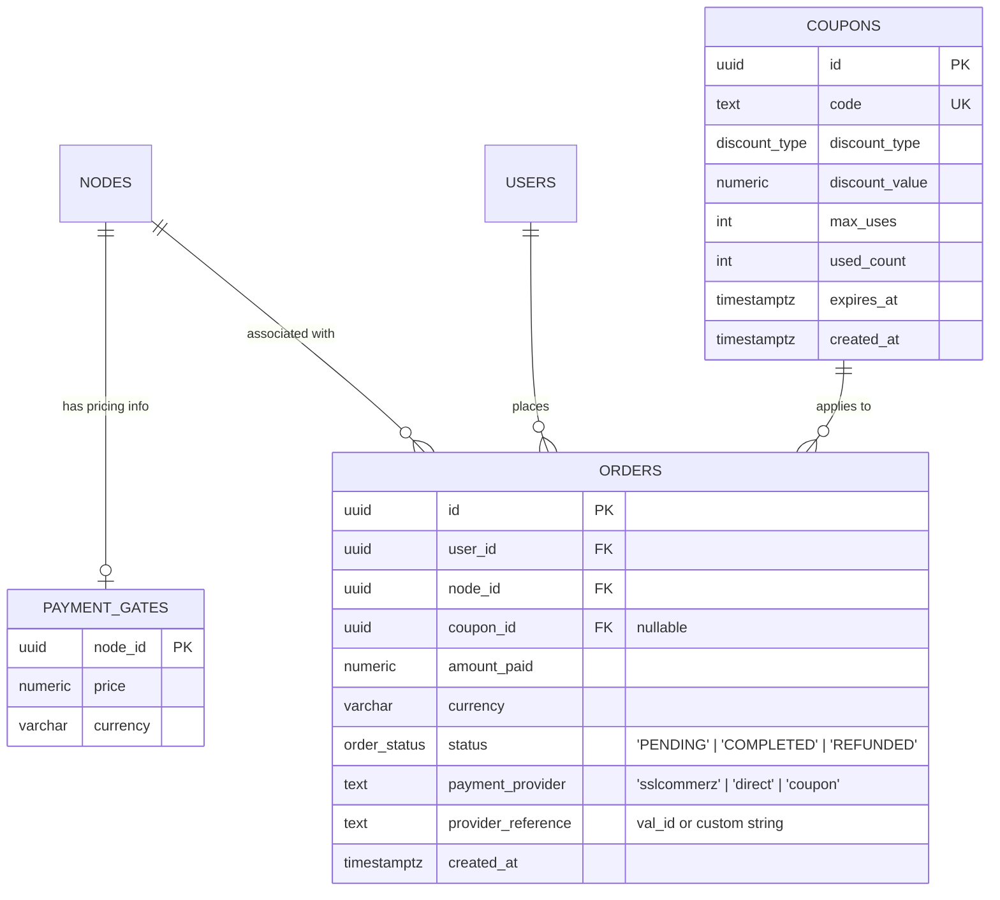
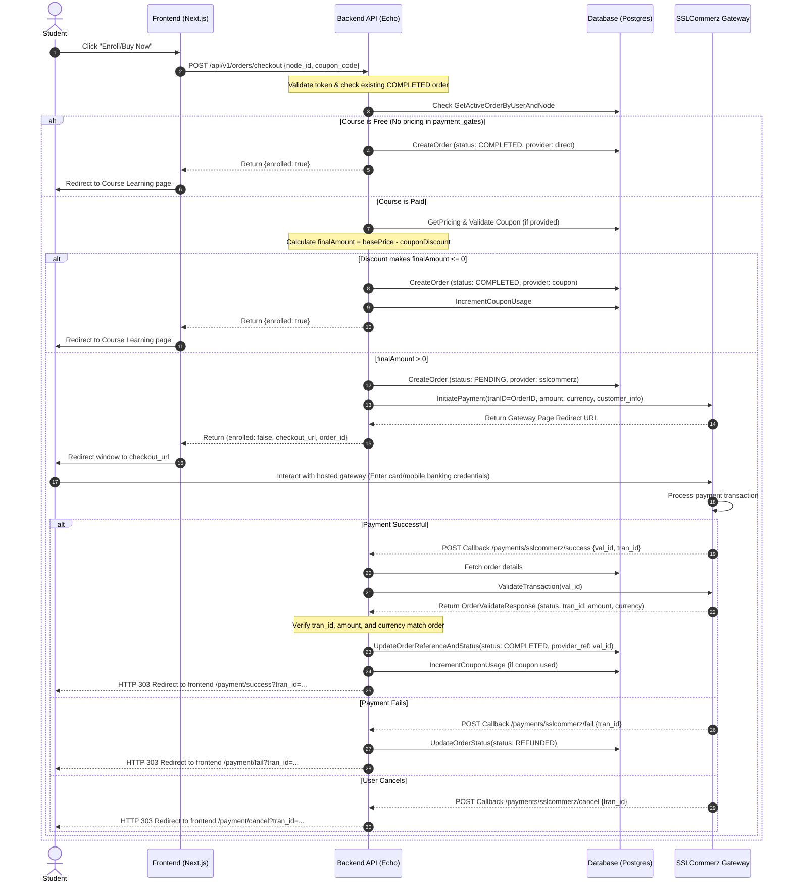

# Course Platform Payment System Documentation

This document provides a highly detailed guide on the design, architecture, and implementation of the payment system in the Course Platform, focusing on **SSLCommerz** integration. It also details the security safeguards implemented and the exact step-by-step checklist for production deployment.

---

## 1. Deployment Readiness Status

> [!IMPORTANT]
> **Production Readiness Status: READY (After Patched Security Vuln)**
> 
> * **Previous Status:** **UNSAFE FOR DEPLOYMENT** due to a critical verification flaw.
> * **Current Status:** **READY** after patching. The backend now performs strict server-to-server validation checks comparing the transaction ID, amount, and currency returned by the SSLCommerz gateway against the local database order.

### The Validation Vulnerability & Patch Details
* **Vulnerability:** Originally, the `/payments/sslcommerz/success` and `/payments/sslcommerz/ipn` endpoints accepted a validation ID (`val_id`) and order ID (`tran_id`) from the request. They called SSLCommerz's `ValidateTransaction` API, but **only checked if the response status was `"VALID"` or `"VALIDATED"`**. 
* **Exploit Vector:** A malicious user could purchase a cheap item (e.g., 10 BDT), obtain a valid `val_id`, and then forge a success callback to the server using the `tran_id` of an expensive course (e.g., 10,000 BDT) and the cheap transaction's `val_id`. Since the gateway confirmed that `val_id` was valid, the backend previously marked the expensive order as completed.
* **The Patch:** The validation interface has been changed from returning a simple `bool` to returning the full `*models.OrderValidateResponse`. The endpoints now verify:
  1. `resp.TranId == order.ID` (checks that the gateway transaction ID matches our database order UUID).
  2. `resp.Amount == order.AmountPaid` (checks that the customer actually paid the correct price).
  3. `resp.Currency == order.Currency` (checks that the currency matches BDT/USD).

---

## 2. Database Models & Schema

The payment system relies on three tables defined in `migrations/000004_commerce.up.sql`:



* **`payment_gates`**: Stores price and currency for a node (course). If a course does not have a row in this table, it is treated as a **free course**.
* **`coupons`**: Stores promotional codes. Can be `FIXED` amount (e.g., -500 BDT) or `PERCENTAGE` based (e.g., -10%).
* **`orders`**: Stores the enrollment record.
  * Status transition: `PENDING` $\rightarrow$ `COMPLETED` (successful payment) or `REFUNDED` (failed payment).

---

## 3. End-to-End Checkout Flow

Here is the step-by-step runtime sequence diagram for course purchasing:



---

## 4. SSLCommerz Integration Code

### A. Gateway Service (`be/internal/services/sslcommerz.go`)
Uses the standard SDK `github.com/sagar290/sslcommerz-go` to connect:
* **`InitiatePayment`**: Prepares customer information (name, email, phone, city), product properties (type category: "Education", profile: "Non-Physical Goods"), callback URLs, and posts to the gateway session creator.
* **`ValidateTransaction`**: Takes the `val_id` from the callback and sends a query to the SSLCommerz server-to-server validation API.

### B. Route Definitions (`be/internal/api/server.go`)
Public HTTP paths used by SSLCommerz's POST redirects must bypass JWT middleware:
* `POST /api/v1/payments/sslcommerz/success` $\rightarrow$ `CommerceHandler.HandleSuccess`
* `POST /api/v1/payments/sslcommerz/fail` $\rightarrow$ `CommerceHandler.HandleFail`
* `POST /api/v1/payments/sslcommerz/cancel` $\rightarrow$ `CommerceHandler.HandleCancel`
* `POST /api/v1/payments/sslcommerz/ipn` $\rightarrow$ `CommerceHandler.HandleIPN`

---

## 5. Steps to Deploy on Production

To successfully transition this system to live production, follow these steps:

### Step 1: Create an SSLCommerz Merchant Account
1. Visit the [SSLCommerz Merchant Signup Portal](https://sslcommerz.com/) and register.
2. Complete corporate KYC (trade license, bank accounts, business details).
3. Obtain two sets of credentials:
   - **Sandbox Accounts** (for staging/test transactions).
   - **Live Production Credentials** (Store ID & Store Password).

### Step 2: Configure Production Environment Variables
On your production hosting server, set up the following environment variables. Do **NOT** commit these to source control.

```env
# SSLCommerz Production Credentials
SSLCOMMERZ_STORE_ID=your_production_store_id
SSLCOMMERZ_STORE_PASSWORD=your_production_store_password
SSLCOMMERZ_IS_SANDBOX=false

# Production Callback URLs (Must be HTTPS public URLs)
SSLCOMMERZ_SUCCESS_URL=https://api.yourdomain.com/api/v1/payments/sslcommerz/success
SSLCOMMERZ_FAIL_URL=https://api.yourdomain.com/api/v1/payments/sslcommerz/fail
SSLCOMMERZ_CANCEL_URL=https://api.yourdomain.com/api/v1/payments/sslcommerz/cancel
SSLCOMMERZ_IPN_URL=https://api.yourdomain.com/api/v1/payments/sslcommerz/ipn

# Frontend Redirection URL (Required for callback redirections)
FRONTEND_URL=https://yourdomain.com
```

### Step 3: SSL / HTTPS Requirement
> [!WARNING]
> SSLCommerz will fail to send post-payment callback redirects if your API service is not secured under valid HTTPS. Make sure your production domain has a valid SSL certificate (e.g. Let's Encrypt, Cloudflare).

### Step 4: Whitelist SSLCommerz IPN Servers (Optional but Recommended)
For defense-in-depth, configure your production reverse proxy (e.g. Nginx) or cloud firewall (e.g. AWS Security Group / Cloudflare) to allow incoming POST requests from SSLCommerz IPN IP ranges to the `/api/v1/payments/sslcommerz/*` endpoints. Contact SSLCommerz support for their official callback/IPN server IP range lists.

### Step 5: Gateway Configuration Panel (SSLCommerz Dashboard)
Log in to your SSLCommerz Merchant Dashboard and verify/input:
1. **Redirect IPN Settings:** Enable IPN and paste `https://api.yourdomain.com/api/v1/payments/sslcommerz/ipn` in the URL field. This ensures that even if a student closes their browser window before redirecting, the enrollment is marked complete via server-to-server IPN.
2. **Channel Activation:** Activate required payment methods (bKash, Nagad, Visa, Mastercard, DBBL, Rocket, Netbanking).

### Step 6: Post-Deployment Smoke Test
Perform a live purchase using a small test amount (e.g., 10 BDT):
1. Navigate to frontend, click "Enroll" on a 10 BDT paid course.
2. Verify redirect to the hosted SSLCommerz payment page (look for live green padlock).
3. Select mobile banking or card, complete transaction.
4. Verify redirection back to the frontend `/payment/success` screen.
5. Check student dashboard to confirm the course is instantly unlocked.
6. Verify in the database that the order status is `COMPLETED` and `provider_reference` holds a valid SSLCommerz `val_id`.
