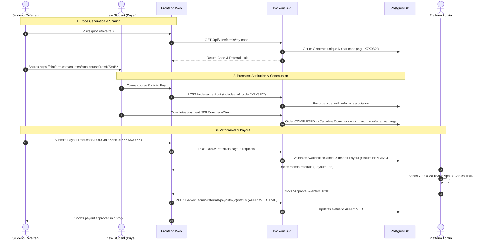

# Complete Referral & bKash Payout System — Roadmap & Workflow

This document outlines the end-to-end architecture, database schema, business rules, API contracts, and UI workflows for the **Affiliate Referral & bKash Payout System**.

---

## 1. System Rules & Core Specifications

1. **Referral Code Format**:
   - Exactly **6 uppercase alphanumeric characters** `[A-Z0-9]` (e.g. `K7X9B2`, `PRO88M`, `9X7A4Q`).
   - Globally unique across all users.
   - Generated automatically for each user or generated on first visit to their referral portal.

2. **Commission & Attribution Logic**:
   - When a student visits with `?ref=CODE` or enters the referral code at checkout:
     - Self-referral is disallowed (a user cannot use their own referral code).
     - When the order transitions to `COMPLETED`, a referral earning record is created for the referrer.
     - Earnings amount = `(Amount Paid * Commission Percentage) / 100`.

3. **Admin Referral Settings**:
   - Configurable **Commission Percentage** (e.g. `10.00%`).
   - Configurable **Minimum Payout Threshold** (e.g. `৳500.00`).
   - **Referral System Enable / Disable** switch.
   - Custom instructions / guidelines for affiliates.

4. **Financial Balance Ledger for Affiliates**:
   - **Total Earned (সর্বমোট আয়)**: Sum of all completed referral earnings.
   - **Total Withdrawn (পরিশোধিত)**: Sum of all `APPROVED` payouts.
   - **Pending Withdrawal (অপেক্ষারত উত্তোলন)**: Sum of all `PENDING` payout requests.
   - **Available Balance (উত্তোলনযোগ্য ব্যালেন্স)**: `Total Earned - Total Withdrawn - Pending Withdrawal`.

5. **bKash Payout Workflow (Manual Processing)**:
   - Student submits a withdrawal request with **bKash Phone Number**, **Account Type (Personal/Agent)**, and **Amount** ($\ge$ minimum threshold and $\le$ available balance).
   - The requested amount is placed on hold (`PENDING`).
   - Admin views the payout in `/admin/referrals` -> **Payout Requests**.
   - Admin sends the money manually via bKash business/personal app.
   - Admin marks the request as:
     - **Approved (সফল)**: Enters bKash Transaction ID (TrxID) and notes.
     - **Rejected (বাতিল)**: Enters rejection reason, which automatically restores the funds to the student's available balance.

---

## 2. Database Schema Design (PostgreSQL)

```mermaid
erDiagram
    users ||--o| referral_codes : "has one"
    referral_codes ||--o{ referral_earnings : "generates"
    orders ||--o| referral_earnings : "attributed to"
    users ||--o{ referral_payouts : "requests"
    users ||--o{ referral_earnings : "receives"

    referral_settings {
        int id PK
        numeric commission_percentage
        numeric min_payout_amount
        boolean is_enabled
        text terms_and_conditions
        timestamptz updated_at
    }

    referral_codes {
        uuid id PK
        uuid user_id FK,UK
        varchar(6) code UK
        timestamptz created_at
    }

    referral_earnings {
        uuid id PK
        uuid referrer_user_id FK
        uuid referred_user_id FK
        uuid order_id FK,UK
        uuid node_id FK
        numeric order_amount
        numeric commission_percentage
        numeric commission_earned
        varchar(3) currency
        varchar(20) status
        timestamptz created_at
    }

    referral_payouts {
        uuid id PK
        uuid user_id FK
        numeric amount
        varchar(3) currency
        varchar(20) payment_method
        varchar(20) account_number
        varchar(20) account_type
        varchar(20) status
        varchar(100) transaction_ref
        text admin_note
        timestamptz processed_at
        timestamptz created_at
    }
```



### Table Definitions:

```sql
-- 1. Referral Settings
CREATE TABLE referral_settings (
    id SERIAL PRIMARY KEY,
    commission_percentage NUMERIC(5, 2) NOT NULL DEFAULT 10.00,
    min_payout_amount NUMERIC(10, 2) NOT NULL DEFAULT 500.00,
    is_enabled BOOLEAN NOT NULL DEFAULT TRUE,
    terms_and_conditions TEXT DEFAULT '',
    updated_at TIMESTAMPTZ NOT NULL DEFAULT NOW()
);

-- 2. User Referral Codes
CREATE TABLE referral_codes (
    id UUID PRIMARY KEY DEFAULT uuid_generate_v4(),
    user_id UUID NOT NULL UNIQUE REFERENCES users(id) ON DELETE CASCADE,
    code VARCHAR(6) NOT NULL UNIQUE,
    created_at TIMESTAMPTZ NOT NULL DEFAULT NOW()
);
CREATE INDEX idx_referral_codes_code ON referral_codes(code);

-- 3. Referral Earnings Ledger
CREATE TYPE referral_earning_status AS ENUM ('COMMISSION_EARNED', 'REFUNDED_REVOKED');

CREATE TABLE referral_earnings (
    id UUID PRIMARY KEY DEFAULT uuid_generate_v4(),
    referrer_user_id UUID NOT NULL REFERENCES users(id) ON DELETE CASCADE,
    referred_user_id UUID NOT NULL REFERENCES users(id) ON DELETE CASCADE,
    order_id UUID NOT NULL UNIQUE REFERENCES orders(id) ON DELETE CASCADE,
    node_id UUID NOT NULL REFERENCES nodes(id) ON DELETE CASCADE,
    order_amount NUMERIC(10, 2) NOT NULL,
    commission_percentage NUMERIC(5, 2) NOT NULL,
    commission_earned NUMERIC(10, 2) NOT NULL,
    currency VARCHAR(3) NOT NULL DEFAULT 'BDT',
    status referral_earning_status NOT NULL DEFAULT 'COMMISSION_EARNED',
    created_at TIMESTAMPTZ NOT NULL DEFAULT NOW()
);
CREATE INDEX idx_referral_earnings_referrer ON referral_earnings(referrer_user_id);

-- 4. Payout Requests Ledger
CREATE TYPE payout_status AS ENUM ('PENDING', 'APPROVED', 'REJECTED');

CREATE TABLE referral_payouts (
    id UUID PRIMARY KEY DEFAULT uuid_generate_v4(),
    user_id UUID NOT NULL REFERENCES users(id) ON DELETE CASCADE,
    amount NUMERIC(10, 2) NOT NULL,
    currency VARCHAR(3) NOT NULL DEFAULT 'BDT',
    payment_method VARCHAR(20) NOT NULL DEFAULT 'bkash',
    account_number VARCHAR(20) NOT NULL,
    account_type VARCHAR(20) NOT NULL DEFAULT 'PERSONAL',
    status payout_status NOT NULL DEFAULT 'PENDING',
    transaction_ref VARCHAR(100),
    admin_note TEXT,
    processed_at TIMESTAMPTZ,
    created_at TIMESTAMPTZ NOT NULL DEFAULT NOW()
);
CREATE INDEX idx_referral_payouts_user_id ON referral_payouts(user_id);
CREATE INDEX idx_referral_payouts_status ON referral_payouts(status);
```

---

## 3. End-to-End User & System Flow



---

## 4. API Endpoints Specification

### A. Student Referral Portal Endpoints (Authenticated User)
| Method | Endpoint | Description |
| :--- | :--- | :--- |
| `GET` | `/api/v1/referrals/overview` | Returns user's referral code, link, balance summary (Total Earned, Paid, Pending, Available), and settings (min threshold, commission rate). |
| `GET` | `/api/v1/referrals/earnings` | List user's referral earnings history with course title, referred user snippet, amount paid, commission earned, date. |
| `GET` | `/api/v1/referrals/payouts` | List user's payout requests history with bKash number, amount, status, TrxID, date. |
| `POST` | `/api/v1/referrals/payout-requests` | Submit new withdrawal request (`amount`, `payment_method: 'bkash'`, `account_number`, `account_type`). |

### B. Checkout Integration
| Method | Endpoint | Description |
| :--- | :--- | :--- |
| `POST` | `/api/v1/orders/checkout` | Accepts optional `referral_code` in payload. Validates code, sets referrer, and calculates commission upon completion. |

### C. Admin Referral Management Endpoints (Admin Role)
| Method | Endpoint | Description |
| :--- | :--- | :--- |
| `GET` | `/api/v1/admin/referrals/settings` | Get global referral settings (commission %, min payout, enabled status, terms). |
| `PUT` | `/api/v1/admin/referrals/settings` | Update referral configuration. |
| `GET` | `/api/v1/admin/referrals/summary` | Summary stats (Total platform referral revenue, Total commissions paid, Pending payouts count & amount). |
| `GET` | `/api/v1/admin/referrals/payouts` | Paginated list of payout requests with status filter (`PENDING`, `APPROVED`, `REJECTED`), search by user/phone. |
| `PATCH` | `/api/v1/admin/referrals/payouts/{id}/status` | Approve or Reject a payout (submit `status`, `transaction_ref`, `admin_note`). |
| `GET` | `/api/v1/admin/referrals/earnings` | Paginated list of all referral earnings across the platform. |

---

## 5. UI/UX Design Breakdown

### 1. Student Referral Portal (`/profile/referrals` or `/referrals`)
- **Hero / Referral Share Card**:
  - Displays large 6-character code (e.g. `K7X9B2`) with **Copy Code** and **Copy Shareable URL** buttons.
  - Social share shortcuts (Facebook, WhatsApp, Telegram).
  - Commission rate explainer badge (e.g., *"কোর্স মূল্যের ১০% কমিশন পান প্রতি সফল বিক্রয়ে"*).
- **Balance & Earnings Stat Cards**:
  - `উত্তোলনযোগ্য ব্যালেন্স (Available Balance)` in green with a prominent **"উত্তোলন করুন (Request Payout)"** button.
  - `সর্বমোট অর্জিত আয় (Total Earned)`.
  - `পরিশোধিত আয় (Total Paid Out)`.
  - `অপেক্ষারত উত্তোলন (Pending Withdrawal)`.
  - `মোট সফল রেফারাল (Total Referrals)`.
- **Withdrawal Modal**:
  - Amount input (with preset "All Available" button and minimum threshold validation).
  - bKash Account Number (with 11-digit Bangladeshi phone validation: `01XXXXXXXXX`).
  - bKash Account Type (`Personal` / `Agent`).
- **Tabbed Activity History**:
  - **Tab 1: রেফারাল আয় (Earnings)**: Table of referred purchases (Course name, Buyer, Order amount, Commission, Date).
  - **Tab 2: উত্তোলনের ইতিহাস (Payouts)**: Table of withdrawal requests (bKash number, Amount, Status badge, bKash TrxID, Date).

### 2. Admin Referral Hub (`/admin/referrals`)
- **Top Metrics Strip**:
  - Total Affiliate Revenue, Total Commissions Paid, Pending Payouts Count, Active Affiliates.
- **Tab 1: উত্তোলন অনুরোধসমূহ (Payout Requests)**:
  - Table with filters (`PENDING`, `APPROVED`, `REJECTED`), search by user/phone.
  - Columns: Student Name/Email, bKash Number & Type, Requested Amount, Status Badge, Date.
  - **Actions**:
    - "Approve Payout" modal: Enter bKash Transaction ID (TrxID) & optional note -> updates status to `APPROVED`.
    - "Reject Payout" modal: Enter rejection reason -> refunds balance to user.
- **Tab 2: রেফারাল হিস্টোরি (All Earnings)**:
  - Full platform ledger of referred orders.
- **Tab 3: রেফারাল সেটিংস (Settings)**:
  - Enable / Disable Referral Program toggle.
  - Commission Percentage input (e.g., `10%`).
  - Minimum Payout Amount in BDT (e.g., `৳500`).
  - Affiliate Terms & Instructions rich text / textarea.

---

## 6. Implementation Checklist & Order of Execution

1. **Database Migration**:
   - Create migration `000011_referral_system.up.sql` with `referral_settings`, `referral_codes`, `referral_earnings`, `referral_payouts`.
2. **Backend SQL & sqlc**:
   - Write queries in `be/internal/db/queries/referral.sql`.
   - Run `sqlc generate`.
3. **Backend Service & Handlers**:
   - Implement `be/internal/handlers/referral.go` (code generator with uppercase 6-char `[A-Z0-9]`, checkout integration, payout approval/rejection).
   - Register routes in `be/internal/api/server.go`.
4. **OpenAPI & Orval Generation**:
   - Update `be/docs/openapi.yaml`, `be/docs/paths/referral.yaml`, `be/docs/paths/admin_referral.yaml`.
   - Run `npm run generate:api` in `fe/`.
5. **Frontend Student Referral Page**:
   - Build `/profile/referrals` or `/referrals` with share cards, payout modal, and ledger tables.
6. **Frontend Admin Referral Hub**:
   - Build `/admin/referrals/page.tsx` with Payout Requests management, Earnings ledger, and Settings tab.
   - Add "Referrals" link to `/admin` sidebar.
7. **Checkout & URL Tracking**:
   - Add referral code capturing from `?ref=...` and checkout payload.
8. **Testing & Verification**:
   - Write comprehensive unit & integration tests for frontend and backend.
   - Run `gofmt`, `go test ./...`, `npm run lint`, and `npm test`.
